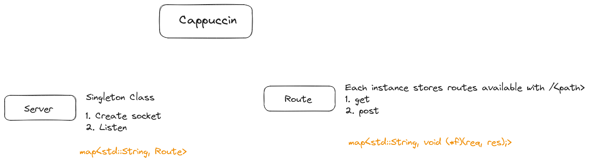

## Cappuccin

A HTTP Server library written in C++ taking express.js as inspiration. 

Logs using `liblogger.so` built from [components](https://github.com/InfiniteVerma/components)

### Why name it 'Cappuccin'?

Express seemed like espresso - o. So I made this project's name Cappuccin (which is cappuccino - o) :)

### Notes on design

### References

 - https://datatracker.ietf.org/doc/html/rfc7231
 - https://www.sohamkamani.com/nodejs/expressjs-architecture/
