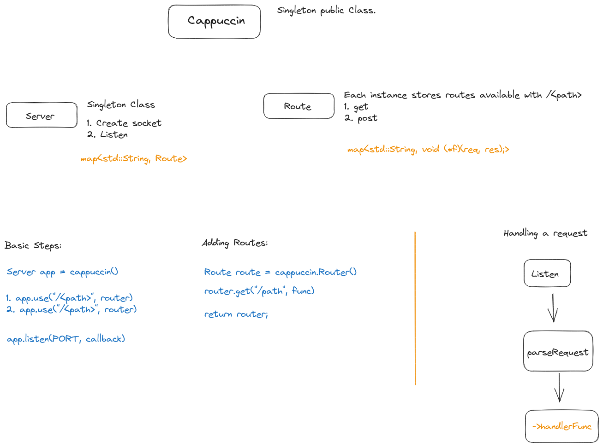

## Cappuccin

A HTTP Server library written in C++ taking express.js as inspiration. 

### Why Cappuccin?

Express seemed like espresso - o. So I made this project, Cappuccin (cappuccino - o) :)

### Notes on design

### References

 - https://datatracker.ietf.org/doc/html/rfc7231
 - https://www.sohamkamani.com/nodejs/expressjs-architecture/
